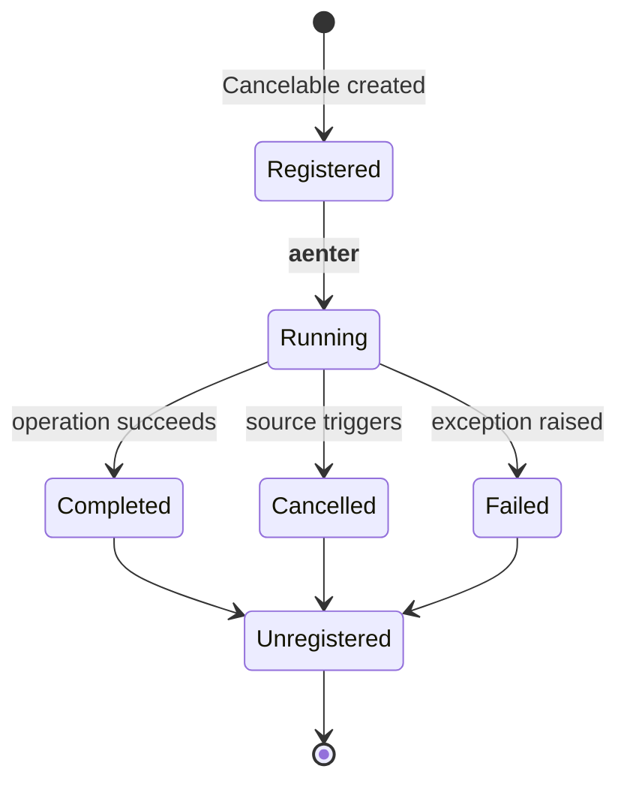

# Operation Registry

The global registry tracks all active cancelable operations for monitoring and debugging.

## Overview

The `OperationRegistry` is a singleton that automatically tracks all `Cancelable` operations. It provides visibility into:

- Currently active operations
- Operation status and progress
- Hierarchical relationships
- Historical operation data

## Accessing the Registry

```python
from hother.cancelable import OperationRegistry

# Get singleton instance
registry = OperationRegistry.get_instance()
```

## Querying Operations

### Get All Active Operations

```python
from hother.cancelable import OperationRegistry

registry = OperationRegistry.get_instance()

# Get all currently running operations
active_ops = registry.get_active_operations()

for op in active_ops:
    print(f"Operation: {op.name}")
    print(f"  ID: {op.id}")
    print(f"  Status: {op.status}")
    print(f"  Elapsed: {op.elapsed_time:.2f}s")
    print(f"  Parent: {op.parent_id}")
```

### Get Operation by ID

```python
op_id = "operation-123"
operation = registry.get_operation(op_id)

if operation:
    print(f"Found: {operation.name}")
    print(f"Status: {operation.status}")
```

### Get Operation by Name

```python
operation = registry.get_operation_by_name("data_processor")

if operation:
    print(f"ID: {operation.id}")
    print(f"Running for: {operation.elapsed_time:.1f}s")
```

### Get Child Operations

```python
# Get all children of a parent operation
parent_op = registry.get_operation_by_name("parent_task")
children = registry.get_children(parent_op.id)

for child in children:
    print(f"Child: {child.name} ({child.status})")
```

## Operation Information

Each operation in the registry contains:

```python
class OperationContext:
    id: str                    # Unique operation ID
    name: str                  # Human-readable name
    status: OperationStatus    # PENDING, RUNNING, CANCELLED, COMPLETED
    start_time: float          # Timestamp when started
    end_time: Optional[float]  # Timestamp when finished
    parent_id: Optional[str]   # Parent operation ID
    cancel_reason: Optional[CancelationReason]  # Why cancelled
    cancel_message: str        # Cancelation message
    progress_callbacks: List   # Registered progress handlers
```

### Status Values

```python
from hother.cancelable import OperationStatus

# Possible statuses
OperationStatus.PENDING    # Created but not started
OperationStatus.RUNNING    # Currently executing
OperationStatus.CANCELLED  # Cancelled by source
OperationStatus.COMPLETED  # Finished successfully
OperationStatus.FAILED     # Finished with error
```

### Cancelation Reasons

```python
from hother.cancelable import CancelationReason

# Why operations cancel
CancelationReason.TIMEOUT     # TimeoutSource triggered
CancelationReason.MANUAL      # TokenSource triggered
CancelationReason.SIGNAL      # SignalSource triggered
CancelationReason.CONDITION   # ConditionSource triggered
```

## Monitoring Dashboard Example

Build a real-time monitoring dashboard:

```python
import anyio
from hother.cancelable import OperationRegistry, Cancelable

async def monitor_operations():
    """Print operation status every second."""
    registry = OperationRegistry.get_instance()

    while True:
        active = registry.get_active_operations()

        print("\n" + "="*60)
        print(f"Active Operations: {len(active)}")
        print("="*60)

        for op in active:
            elapsed = op.elapsed_time
            print(f"📊 {op.name}")
            print(f"   ID: {op.id[:8]}...")
            print(f"   Status: {op.status}")
            print(f"   Elapsed: {elapsed:.1f}s")

            if op.parent_id:
                parent = registry.get_operation(op.parent_id)
                if parent:
                    print(f"   Parent: {parent.name}")

        await anyio.sleep(1.0)

async def main():
    # Start monitoring in background
    async with anyio.create_task_group() as tg:
        tg.start_soon(monitor_operations)

        # Run some operations
        async with Cancelable(name="task_1") as cancel:
            await anyio.sleep(5)

anyio.run(main)
```

## Operation Lifecycle

Understanding operation registration and cleanup:



### Automatic Registration

Operations are automatically registered when created:

```python
# Auto-registered (default)
async with Cancelable(name="auto_registered") as cancel:
    await operation()
    # Automatically unregistered after context exits

# Disable auto-registration (not recommended)
async with Cancelable(name="manual", auto_register=False) as cancel:
    await operation()
    # NOT in registry
```

### Manual Cleanup

The registry automatically cleans up completed operations, but you can manually clear if needed:

```python
registry = OperationRegistry.get_instance()

# Clear all operations (use with caution!)
registry.clear()

# In tests, use clean registry
registry.clear()
# ... run test ...
registry.clear()  # Cleanup after
```

## Hierarchical Tracking

The registry tracks parent-child relationships:

```python
registry = OperationRegistry.get_instance()

async with Cancelable(name="parent") as parent:
    parent_id = parent.context.id

    async with Cancelable(name="child_1", parent=parent) as child1:
        # Query hierarchy
        children = registry.get_children(parent_id)
        assert len(children) == 1
        assert children[0].name == "child_1"

    async with Cancelable(name="child_2", parent=parent) as child2:
        children = registry.get_children(parent_id)
        assert len(children) == 1  # child_1 already completed
```

## Examples

### Export Metrics

```python
def export_operation_metrics():
    """Export metrics for Prometheus/Datadog."""
    registry = OperationRegistry.get_instance()
    active = registry.get_active_operations()

    metrics = {
        "active_operations": len(active),
        "operations_by_status": {
            "running": sum(1 for op in active if op.status == OperationStatus.RUNNING),
            "pending": sum(1 for op in active if op.status == OperationStatus.PENDING),
        },
        "longest_running": max(
            (op.elapsed_time for op in active),
            default=0
        )
    }

    return metrics
```

### Health Check Endpoint

```python
from fastapi import FastAPI
from hother.cancelable import OperationRegistry

app = FastAPI()

@app.get("/health/operations")
async def operation_health():
    """Health check showing active operations."""
    registry = OperationRegistry.get_instance()
    active = registry.get_active_operations()

    return {
        "status": "healthy",
        "active_count": len(active),
        "operations": [
            {
                "name": op.name,
                "status": op.status.value,
                "elapsed": round(op.elapsed_time, 2)
            }
            for op in active
        ]
    }
```

### Alert on Long-Running Operations

```python
import anyio

async def monitor_long_running():
    """Alert if operations run too long."""
    registry = OperationRegistry.get_instance()

    while True:
        active = registry.get_active_operations()

        for op in active:
            if op.elapsed_time > 300:  # 5 minutes
                await send_alert(
                    f"Long-running operation: {op.name} "
                    f"({op.elapsed_time:.0f}s)"
                )

        await anyio.sleep(60)  # Check every minute
```

## Common Patterns

### Find Stuck Operations

```python
def find_stuck_operations(threshold_seconds: float = 300):
    """Find operations running longer than threshold."""
    registry = OperationRegistry.get_instance()
    active = registry.get_active_operations()

    stuck = [
        op for op in active
        if op.elapsed_time > threshold_seconds
    ]

    return stuck
```

### Operation Tree Visualization

```python
def print_operation_tree():
    """Print hierarchical operation tree."""
    registry = OperationRegistry.get_instance()
    active = registry.get_active_operations()

    # Find root operations (no parent)
    roots = [op for op in active if not op.parent_id]

    def print_node(op, indent=0):
        prefix = "  " * indent
        print(f"{prefix}├─ {op.name} ({op.status}, {op.elapsed_time:.1f}s)")

        children = registry.get_children(op.id)
        for child in children:
            print_node(child, indent + 1)

    for root in roots:
        print_node(root)
```

### Progress Aggregation

```python
def aggregate_progress():
    """Calculate overall progress across all operations."""
    registry = OperationRegistry.get_instance()
    active = registry.get_active_operations()

    total_weight = len(active)
    completed_weight = sum(
        1 for op in active
        if op.status == OperationStatus.COMPLETED
    )

    if total_weight == 0:
        return 100.0

    return (completed_weight / total_weight) * 100
```

## Maintenance

### cleanup_completed()

Remove completed operations from registry to prevent memory growth:

```python
from hother.cancelable import OperationRegistry

registry = OperationRegistry.get_instance()

# Remove operations completed more than 1 hour ago
await registry.cleanup_completed(max_age_seconds=3600)

# Or cleanup all completed
await registry.cleanup_completed()
```

**Use cases**:
- Long-running services
- Preventing memory leaks
- Periodic maintenance tasks

## Historical Queries

### get_history()

Retrieve historical operations including completed and cancelled:

```python
# Get last 100 operations
history = await registry.get_history(limit=100)

for op in history:
    print(f"{op.name}: {op.status} - {op.elapsed_time}s")

# Filter by status
completed = await registry.get_history(
    status=OperationStatus.COMPLETED,
    limit=50
)
```

**Parameters**:
- `limit` - Maximum operations to return
- `status` - Filter by status (COMPLETED, CANCELLED, etc.)
- `since` - Operations after timestamp

## Bulk Cancelation

### cancel_all() with Filters

Bulk cancelation with pattern matching:

```python
# Cancel all operations for a user
await registry.cancel_all(
    name_pattern="user_123_*",
    reason=CancelationReason.MANUAL
)

# Cancel all long-running operations
await registry.cancel_all(
    min_age_seconds=300,  # Older than 5 minutes
    reason=CancelationReason.TIMEOUT
)

# Cancel operations matching complex criteria
await registry.cancel_all(
    filter_func=lambda op: op.context.metadata.get('priority') == 'low',
    reason=CancelationReason.MANUAL
)
```

**Parameters**:
- `name_pattern` - Glob pattern for operation names
- `min_age_seconds` - Minimum age in seconds
- `max_age_seconds` - Maximum age in seconds
- `filter_func` - Custom filter function
- `reason` - Cancelation reason to record
